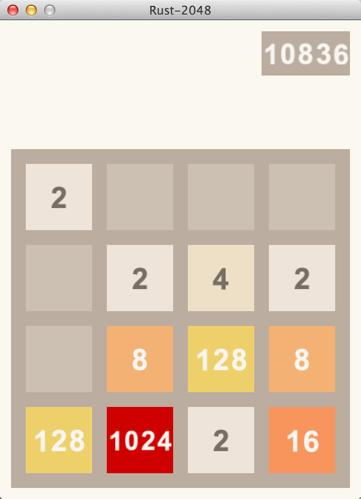

rust-2048
=========

A 2048 clone with Piston game engine.

How to play
-----------
Use arrow key to move tiles.



## Building Instructions

To build this repository, you need [Cargo](https://github.com/rust-lang/cargo).

You also need the _Freetype 6_ and _SDL2_ libs.
Look at [Piston-Tutorials - Installing Dependencies](https://github.com/PistonDevelopers/Piston-Tutorials/tree/master/getting-started#installing-dependencies) and [Rust-SDL2 - Requirements](https://github.com/AngryLawyer/rust-sdl2#sdl20--development-libraries) how to install them.


Clone this repository
```
git clone https://github.com/Coeuvre/rust-2048.git
```

Use Cargo to build
```
cargo build
```

Play!
```
cargo run
```
